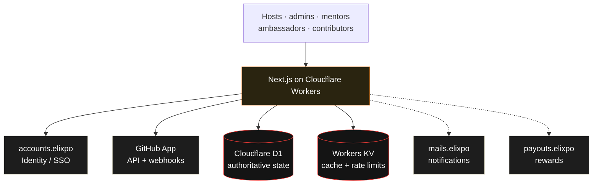

<h1 align="center">Elixpo Open Source</h1>

<p align="center">
  <strong>The operating platform for open-source contests and contributor programs.</strong><br/>
  Run onboarding, mentorship, repository activity, leaderboards, and rewards from one workspace.
  Free and open source, built with the Elixpo community.
</p>

<p align="center">
  <a href="https://opensource.elixpo.com">opensource.elixpo.com</a> ·
  <a href="https://elixpo.com">Elixpo</a> ·
  <a href="https://github.com/orgs/elixpo/discussions">Discussions</a> ·
  <a href="https://github.com/elixpo/opensource/issues">Issues</a> ·
  <a href="https://github.com/sponsors/Circuit-Overtime">Sponsor</a>
</p>

<p align="center">
  <a href="https://opensource.elixpo.com"></a>
  
  
  
  
  
</p>

---

## About

**Elixpo Open Source** is a multi-tenant platform for running complete
open-source contests, mentorship programs, campus initiatives, contribution
sprints, and long-running community programs. A host connects a GitHub
organization or selected repositories, defines a contest, invites the team,
and operates the full program from a role-aware workspace.

> This repository is the source for the official hosted platform at
> [opensource.elixpo.com](https://opensource.elixpo.com).

### Why Elixpo Open Source?

- **Complete contest lifecycle** — Configure applications, schedules, repositories, rules, reviews, results, and rewards for programs lasting weeks or months.
- **Every role included** — Give scoped workspaces to hosts, co-hosts, project admins, mentors, campus ambassadors, and contributors.
- **GitHub-native tracking** — Follow issues, claims, pull requests, reviews, merges, and repository activity without replacing GitHub.
- **Mentorship operations** — Manage review queues, mentees, office hours, check-ins, and recognition.
- **Fair gamification** — Build transparent points, badges, streaks, and leaderboards on an append-only ledger.
- **Auditable administration** — Record role changes, manual overrides, verification decisions, and reward approvals with an actor and reason.
- **Elixpo-managed essentials** — Use Elixpo Accounts for identity and connect to shared mail and payout services as those phases land.

## Product model

A host can create multiple contests and invite other hosts. Each contest owns
its schedule, repositories, roles, label rules, contribution activity,
leaderboards, and reward configuration.

| Role | Primary workspace responsibilities |
| --- | --- |
| **Host owner / co-host** | Contest setup, organization access, team invitations, analytics, and rewards |
| **Project admin** | Repository configuration, issues, contribution verification, and rule enforcement |
| **Mentor** | Reviews, mentee support, office hours, check-ins, and justified bonus points |
| **Campus ambassador** | Campus onboarding, outreach activity, and participant support |
| **Contributor** | Issue discovery, claims, pull requests, points, rankings, and rewards |
| **Spectator** | Public contest pages, projects, profiles, and leaderboards |

## Project status

The platform is under active development. The current foundation includes:

- A responsive public landing page and role-aware host panel.
- Contest creation and workspace route foundations.
- Cloudflare Workers deployment through the OpenNext adapter.
- D1 schema and migrations for contests, memberships, repositories, activity, points, invitations, webhooks, and audits.
- KV bindings for disposable cache data and best-effort rate limiting.
- SOPS and age-based encrypted environment management.

Identity integration, GitHub App ingestion, complete role dashboards, and
production workflows are being delivered incrementally. Follow the
[issue tracker](https://github.com/elixpo/opensource/issues) for scoped work.

## Running this project locally

Requirements: Node.js 20 or newer, npm, and SOPS for shared secret management.

```bash
cp .env.example .env.local
npm install
npm run db:migrate:local
npm run dev
```

Open [http://localhost:3000](http://localhost:3000).

Useful checks:

```bash
npm run typecheck
npm run build
npm run cf:build
npm run cf:preview
```

## Cloudflare infrastructure

Production runs as a **Cloudflare Worker** through the OpenNext adapter.
**D1** is authoritative for contest and contribution state. **KV** is used only
for disposable cached views and best-effort rate-limit counters because KV is
eventually consistent.

| Binding | Responsibility |
| --- | --- |
| `DB` | Contests, memberships, repositories, contributions, points, invitations, webhooks, and audits |
| `CACHE` | Disposable dashboard and computed-view caches |
| `RATE_LIMITS` | Best-effort request quotas; never authorization or reward state |
| `ASSETS` | OpenNext static assets |

Provision the resources once and replace the placeholder IDs in
[`wrangler.jsonc`](wrangler.jsonc):

```bash
npx wrangler d1 create opensource-elixpo
npx wrangler kv namespace create CACHE
npx wrangler kv namespace create RATE_LIMITS
npm run cf:typegen
```

Manage the versioned D1 schema with:

```bash
npm run db:migrations:list:local
npm run db:migrate:local
npm run db:migrations:list:remote
npm run db:migrate:remote
```

Remote migrations run before the Worker deployment in the manually triggered,
protected `Deploy Cloudflare Worker` GitHub Actions workflow.

## Environment and SOPS

- `.env.example` documents expected application variables.
- `.env.local` contains plaintext developer values and is ignored by Git.
- `.env` is the committed SOPS-encrypted shared environment file.
- `.sops.yaml` contains public age recipients; private keys never enter the repository.

```bash
npm run env:decrypt   # .env -> .env.local
npm run env:encrypt   # .env.local -> .env
```

Wrangler commands disable automatic `.env` loading so SOPS ciphertext cannot
become Worker bindings. Runtime secrets are declared in `wrangler.jsonc` and
uploaded to Cloudflare separately.

## The ecosystem

| Tool | What it does | Link |
| --- | --- | --- |
| 🎨 **Elixpo Art** | AI image generation _(under development)_ | [art.elixpo.com](https://art.elixpo.com) |
| ✍️ **Elixpo Blogs** | A rich writing and publishing space | [blogs.elixpo.com](https://blogs.elixpo.com) |
| 🖊️ **LixSketch** | A hand-drawn whiteboard for ideas and diagrams | [sketch.elixpo.com](https://sketch.elixpo.com) |
| 💬 **Elixpo Chat** | A real-time AI chat experience _(under development)_ | [chat.elixpo.com](https://chat.elixpo.com) |
| 👤 **Elixpo Accounts** | One identity across the ecosystem | [accounts.elixpo.com](https://accounts.elixpo.com) |
| 🔗 **lixrl** | The flagship Elixpo URL shortener | [lixrl.com](https://lixrl.com) |
| 🧑‍💻 **Elixpo Open Source** | Open-source contest and program operations | [opensource.elixpo.com](https://opensource.elixpo.com) |
| 🪪 **Portfolios** | Personal pages for showcasing work | [me.elixpo.com](https://me.elixpo.com) |
| 🐼 **Oreo** | The mascot's home | [oreo.elixpo.com](https://oreo.elixpo.com) |

## Architecture

The web application runs on Cloudflare Workers. D1 stores authoritative state,
KV supports cache and rate limiting, Elixpo Accounts provides identity, and a
GitHub App supplies repository activity.



A broader ecosystem view is available at
**[elixpo.com/architecture](https://elixpo.com/architecture)**.

## Built by the community

Elixpo is made by people, in the open. A small core team steers the ecosystem:

- **Ayushman Bhattacharya** — Founder & Lead ([@Circuit-Overtime](https://github.com/Circuit-Overtime))
- **Vivek Yadav** — Lead Co-Developer ([@ez-vivek](https://github.com/ez-vivek))
- **Anwesha Chakraborty** — Core Maintainer ([@anwe-ch](https://github.com/anwe-ch))

Everyone is welcome. Browse the
[issue tracker](https://github.com/elixpo/opensource/issues) and join
[Elixpo Discussions](https://github.com/orgs/elixpo/discussions).

## Recognition and programs

Elixpo has taken part in and been supported by **GSSOC**,
**Hacktoberfest**, **Pollinations.AI**, **Microsoft for Startups Founders Hub**,
and **OSCI**.

## Get involved

- 💬 Join the conversation in [GitHub Discussions](https://github.com/orgs/elixpo/discussions).
- 🛠️ Pick a scoped task from the [issue tracker](https://github.com/elixpo/opensource/issues).
- 🧭 Help shape the platform through product and architecture proposals.
- ❤️ Support Elixpo through [GitHub Sponsors](https://github.com/sponsors/Circuit-Overtime).

## Brand assets

Product marks and visual assets belong under `public/`. The ecosystem brand
source of truth is
[`elixpo/brand/MASCOT.md`](https://github.com/elixpo/elixpo/blob/main/brand/MASCOT.md),
with a browsable kit at **[elixpo.com/assets](https://elixpo.com/assets)**.

## License

Elixpo uses one licensing standard across every repository:

- **Code** — [MIT](LICENSES/preferred/MIT) with the [Oreo-trademarks exception](LICENSES/exceptions/Oreo-trademarks).
- **Brand and visual assets** — [CC-BY-4.0](LICENSES/preferred/CC-BY-4.0) with the same exception.

The Oreo mascot, chest E-badge, Elixpo and Oreo names, official domains, and
brand palette remain reserved. See [`LICENSE`](LICENSE) and the product-specific
[`NOTICE`](LICENSES/NOTICE).

## Exclusive

> Per-repository exclusive artifacts—such as a hosted SaaS, package, extension,
> or paid tier—are declared here and in [`NOTICE`](LICENSES/NOTICE).

**This repository:** `opensource.elixpo.com` is the official hosted Elixpo Open
Source platform. The hosted service, its operational data, the “Elixpo Open
Source” product identity, and its official domain are reserved to Elixpo. The
source code is MIT and may be reused; forks must operate under a different name
and domain and may not present themselves as the official Elixpo service. This
repository does not currently publish a separate npm package, marketplace
extension, or binary distribution.

## Star history

<p align="center">
<a href="https://www.star-history.com/?repos=elixpo%2Fopensource&type=date&legend=top-left">
 <picture>
   <source media="(prefers-color-scheme: dark)" srcset="https://api.star-history.com/image?repos=elixpo/opensource&type=date&theme=dark&legend=top-left" />
   <source media="(prefers-color-scheme: light)" srcset="https://api.star-history.com/image?repos=elixpo/opensource&type=date&legend=top-left" />
   
 </picture>
</a>
</p>

---

<p align="center">
  <sub>Made in the open, together. © 2023–2026 Elixpo.</sub>
</p>
